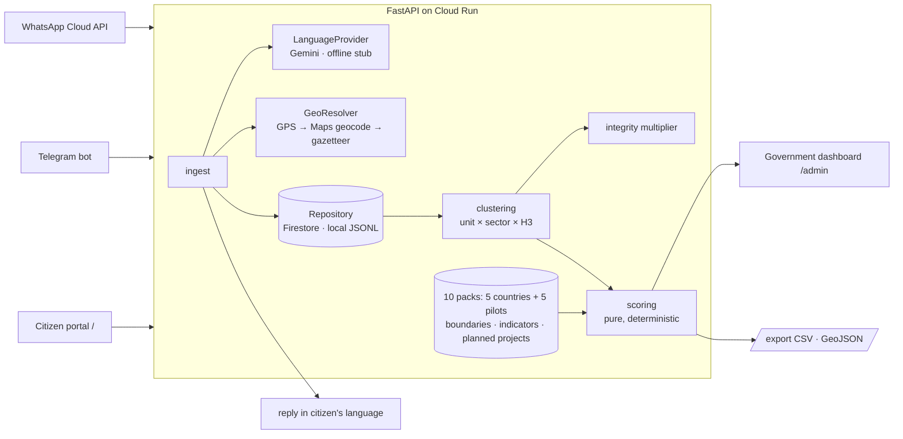

# Vikas Vaani: Civic Demand Platform

**Build with AI: Code for Communities 2.0 · BRICS Track 1 (Innovation)**

Governments resolve individual grievances fast. Nobody can tell a district which 10 projects to fund next, or whether
the loudest requests are the neediest. This is the planning layer above grievance systems (CPGRAMS in India, Ouvidorias
in Brazil, Gosuslugi in Russia, 12345 hotlines in China, Presidential Hotline in South Africa), for all five BRICS
countries:

1. Citizens file on the **web portal** or send a WhatsApp/Telegram voice note or text, in their own language
   (Portuguese, Russian, Hindi, Marathi, Chinese, English, isiZulu, isiXhosa, Afrikaans…).
2. Gemini transcribes, translates, classifies and extracts places (it classifies; it never scores).
3. Requests are geo-resolved to district and H3 cell and clustered.
4. Clusters are fused with district need indicators (MPI, NFHS-5, Jal Jeevan Mission…) and planned investments.
5. A **deterministic, auditable** score ranks them, with an equity weight, an integrity check against brigading,
   and a score breakdown for every project.
6. Citizens get a tracking ID in their own language; anonymised aggregates are exported as open data.

> **Demo data is synthetic.** Every request under `data/synthetic/` has `synthetic: true`, and indicators are
> flagged placeholders until real extracts land in `data/raw/<PACK>/` (see [docs/data-sources.md](docs/data-sources.md)).
> Boundaries and populations are real (geoBoundaries, Kontur, IBGE and Census of India; see
> [data/LICENSE-DATA.md](data/LICENSE-DATA.md)).

## Two faces, one app

| Page | Who | What |
|---|---|---|
| `/` citizen portal | residents | Choose your country once (the portal stays set to it), your state and city (remembered as your area), a category, then describe the problem by text or voice, optionally with GPS. You get a tracking ID and an acknowledgement in your language, and can track status later |
| `/admin` government dashboard | officials | Choose the country, then a state, then a district or city: the map zooms to that area and shows only its problems, ranked. Switch weightings (volume, balanced, equity), read the score breakdown, see silent areas and flagged campaigns, and approve or change status. Status changes reach every citizen in the cluster |

## Coverage

Each country has a **country view** (units are states or provinces) and a **district-level pilot** in one of its
poorest regions:

| Country | Country view | Pilot (district level) |
|---|---|---|
| Brazil | 27 states | Alagoas, 102 municipalities |
| Russia | 83 federal subjects | Tuva, 17 kozhuuns and 2 cities |
| India | 36 states and UTs | Maharashtra, 36 districts |
| China | 31 mainland provinces | Ningxia, 19 counties |
| South Africa | 9 provinces | Eastern Cape, 6 districts and 2 metros |

A complaint is interpreted once and filed into both views: the country view (by state) always, the pilot view
(by district) when it falls inside the pilot. WhatsApp messages are routed to a country by calling code.

## Architecture



## Priority score

```
Priority(c) = 100 × [0.25·Demand + 0.30·Need + 0.20·Equity + 0.15·Alignment + 0.10·Urgency] × Integrity(c)
```

| Component | Definition |
|---|---|
| Demand | log(1 + unique requesters) ÷ district population per 10k, min-max within the state. Counts people, not messages |
| Need | Sector deficit from official data (e.g. water = 1 − JJM tap coverage), min-max within the state |
| Equity | District MPI headcount ratio (normalised) + 0.1 if an Aspirational District |
| Alignment | 1 if no planned project covers it, 0.5 if planned but delayed, 0 if funded |
| Urgency | Share of requests flagged as a safety/health risk |
| Integrity | 0.5-1.0 multiplier penalising low sender diversity, bursts (30 min) and near-duplicate text |

Clusters with fewer than 3 unique requesters are "emerging", not ranked. Presets: `balanced`, `equity_first`,
and a `volume_only` baseline (raw message count, what naive systems do). Every ranked item carries its
`contributions`, `integrity_penalty` and a `robust` flag (stays top-10 when any weight moves ±20%).
Details: [docs/schema.md](docs/schema.md).

## Quickstart (Windows, from the repo root)

**One click:** double-click `start.bat` (or run `.\start.ps1`). It creates `.venv`, installs the backend, prepares
the demo data on first run, starts the server and opens http://127.0.0.1:8000/. `.\start.ps1 -Reset` reloads the demo
complaints. The pages only work when served this way, not opened as files.

Manual steps, if you prefer:

```powershell
python -m venv .venv
.venv\Scripts\python -m pip install -r backend\requirements-dev.txt
cd backend
..\.venv\Scripts\python -m scripts.build_indicators --pack all --allow-placeholder
..\.venv\Scripts\python -m scripts.generate_synthetic --pack all
..\.venv\Scripts\python -m scripts.seed --reset
..\.venv\Scripts\python -m uvicorn app.main:app --reload
```

Open http://127.0.0.1:8000/ for the citizen portal, http://127.0.0.1:8000/admin for the government dashboard and
http://127.0.0.1:8000/docs for the API. Run the tests with `..\.venv\Scripts\python -m pytest` from `backend/`.

Settings come from environment variables or a repo-root `.env`: `GEMINI_API_KEY` and `PHONE_HASH_SALT` at minimum;
`PACK_ID` (default pack, `IN`), `PACKS` (comma list to serve a subset), `REPOSITORY` (`local` | `memory` | `firestore`),
`LOCAL_STORE_DIR` (default `data/store`, one `<PACK>/requests.jsonl` per pack). Without `GEMINI_API_KEY`, an offline
keyword stub is used: text only, no translation, no voice, and template briefings instead of AI ones. Don't demo with it.

Security: set `ADMIN_TOKEN` to require the `X-Admin-Token` header for officials' actions (status changes, AI
briefings); the dashboard asks for it once per session. Without it those actions are open (fine locally, never in
production). `RATE_LIMIT_SCALE` scales the per-client limits on intake, AI and place search (default 1; 0 disables).

Maps and place search:

| Setting | Effect |
|---|---|
| `GOOGLE_MAPS_BROWSER_KEY` | Google Maps in both pages (Maps JavaScript API). Restrict it by HTTP referrer. Falls back to `GOOGLE_MAPS_API_KEY` |
| `GOOGLE_MAPS_API_KEY` | Server-side Google geocoding of typed places (Geocoding API). Never sent to the browser |
| `GEOCODER` | `auto` (default: Google if keyed, else OpenStreetMap Nominatim), `google`, `nominatim` or `none` |

With no Google key, maps use OpenStreetMap data (CARTO tiles, via Leaflet) and place search uses Nominatim, one request
per second as its usage policy asks. Both are free for a prototype; use Google or your own tile and Nominatim server at
scale.

## Generative AI features (Gemini)

| Where | Feature |
|---|---|
| Portal | **Check with AI**: reads the draft in any language, shows the detected language, problem, urgency, English translation and place, and fills in the category and location |
| Portal | Voice notes transcribed and translated (Gemini is multimodal) |
| Dashboard | **AI brief on this problem**: what residents report, how many and since when, urgency, a concrete next step and department, in English or the region's languages |
| Dashboard | **Brief me on this area**: top priorities and why they rank high, silent areas needing outreach, suspected campaigns |
| Everywhere | Every complaint is classified, translated and redacted into an English summary on intake |

The model sees only redacted English summaries and score inputs, and is told not to invent facts or rank anything. The
priority score stays a fixed public formula. Without a key, each feature falls back to a labelled template.

`data/reference/` is committed. To rebuild it from the open sources (about 300 MB download, cached in `data/cache/`):
`python -m scripts.build_reference --pack all`.

## API

Every read endpoint takes `?pack=<PACK_ID>` (default `PACK_ID`).

| Method | Path | Purpose |
|---|---|---|
| GET | `/`, `/admin` | Citizen portal; government dashboard |
| GET | `/health`, `/packs`, `/meta` | Status; the packs served; one pack's units, presets, provider, synthetic flags, counts |
| GET | `/boundaries` | The pack's unit polygons (GeoJSON) |
| GET | `/config` | Which map (Google or OpenStreetMap) and AI provider are active; the browser map key |
| GET | `/geocode` | Find a typed place inside the picked area: `q`, `pack`, `admin_code` |
| GET | `/points` | Complaint locations for the map, rounded to about 100 m |
| POST | `/ingest` | Web intake: `{text?, audio_base64?, audio_mime?, sender_id?, lat?, lon?, location_text?, location_confidence?, pack?, admin_code?, category?}` |
| POST | `/assist/understand` | AI read of a draft complaint: language, sector, urgency, translation, places |
| POST | `/assist/brief` | AI briefing for officials on a cluster (`cluster_id`) or an area (`admin_code`), in `lang` |
| GET | `/track/{id}` | Citizen lookup by tracking ID across packs |
| GET/POST | `/webhooks/whatsapp` | Meta verification and inbound messages (text, voice, location), routed by calling code |
| POST | `/webhooks/telegram` | Telegram bot updates (text, voice), default pack's country |
| GET | `/rankings` | `preset=` plus optional weight overrides, `sector=`, `admin_code=`, `limit=` |
| GET | `/rankings/compare` | Where two presets send the top k (poorest quartile vs least-poor units) |
| GET | `/clusters/{id}` | Score breakdown, integrity flags, redacted request summaries |
| POST | `/clusters/{id}/status` | Officials set `forwarded`, `in_progress` or `resolved` for every request in a cluster |
| GET | `/districts`, `/districts/silent` | Indicators + request rates; poor units with the fewest requests |
| GET | `/requests`, `/requests/{id}` | Redacted request list (review queue: `?status=needs_review`) |
| GET | `/export/aggregates.csv`, `.geojson` | Anonymised aggregates (`level=district\|h3`), groups under 5 people suppressed |

## Deploy (Cloud Run)

```bash
gcloud run deploy civic-api --source . --region asia-south1 --allow-unauthenticated \
  --set-env-vars REPOSITORY=firestore,LANGUAGE_PROVIDER=gemini \
  --set-secrets GEMINI_API_KEY=gemini-key:latest,PHONE_HASH_SALT=phone-salt:latest
```

Seed Firestore once with `REPOSITORY=firestore python -m scripts.seed --reset` (uses your gcloud credentials; one
collection per pack, `requests_<PACK>`). For a throwaway demo without Firestore, set `LOCAL_STORE_DIR=data/synthetic`
instead, which serves the shipped synthetic sets directly (the container disk is ephemeral). Point the WhatsApp webhook at `https://<service>/webhooks/whatsapp`; for Telegram call
`setWebhook` with `url=https://<service>/webhooks/telegram&secret_token=<TELEGRAM_WEBHOOK_SECRET>`.

## Privacy and safety (DPDP Act 2023)

- Phone numbers are never stored: `requester_hash` = HMAC-SHA256(salt, channel:sender). Rotating the salt unlinks history.
- Raw audio is never stored; it is passed to the language provider and dropped.
- Phone numbers, emails and Aadhaar-shaped numbers are regex-redacted on top of Gemini's redacted summary.
- The API never returns requester hashes or original text; exports are aggregates with k ≥ 5 suppression.
- The LLM never computes or overrides a score; rankings are recommendations for human review. AI briefings see only
  redacted summaries and score inputs.
- HTTP hardening: security headers and a Content-Security-Policy on the pages, integrity-pinned Leaflet, per-client
  rate limits (429 with Retry-After), a 10 MB cap on audio, and citizen text fenced off as data in AI prompts so a
  complaint cannot instruct the model.
- Accessibility: WCAG AA colour contrast throughout, labelled controls, live regions for results, a text alternative to
  the map (the priority list), and reduced-motion support.
- Complaint locations shown on maps are rounded to about 100 m. Typed places are sent to the geocoder (Google or
  OpenStreetMap Nominatim) without any other complaint data.
- Free-tier Gemini inputs may be used to improve Google's models: use only synthetic data on it; production would run
  on Vertex AI or a paid tier.

## Designed to meet the DPG Standard

Apache-2.0 code, CC BY 4.0 docs and synthetic data ([OWNERSHIP.md](OWNERSHIP.md), [data/LICENSE-DATA.md](data/LICENSE-DATA.md)).
Platform independence: Gemini sits behind `LanguageProvider` (open alternative: AI4Bharat IndicConformer +
IndicTrans2), Firestore behind `RequestRepository` (open alternative: Postgres/PostGIS). Standards: OpenAPI 3,
GeoJSON, H3, ISO 639 / BCP-47, ISO 3166-2. We claim "designed to meet the DPG Standard", not "is a DPG".

## BRICS generalisation

A region is a **pack**: `data/packs/<ID>.json` + `data/reference/<ID>/` (units, boundaries, populated places) +
indicator files. All five BRICS countries ship, each at state level plus one district-level pilot. The core schema,
scoring and API do not change between them. Adding a region (another pilot state, or a new BRICS member) is data
work only. See [docs/schema.md](docs/schema.md#country-packs).

## Repository layout

```
backend/app/        FastAPI app: ingest, language, geo, clustering, integrity, scoring, service, channels
backend/scripts/    build_reference, build_indicators, generate_synthetic, seed
backend/tests/      pytest suite (self-contained test pack)
data/packs/         10 pack configs (5 countries, 5 pilot regions)
data/reference/     per pack: units (names, aliases, population, centroid), boundaries, populated places
data/raw/           real source extracts, per pack (you add these)
data/processed/     per pack: built indicator tables and planned projects
data/synthetic/     per pack: labelled synthetic requests + manifest
docs/               schema and data sources
frontend/           citizen portal (index.html) and government dashboard (admin.html), served by the API
```
