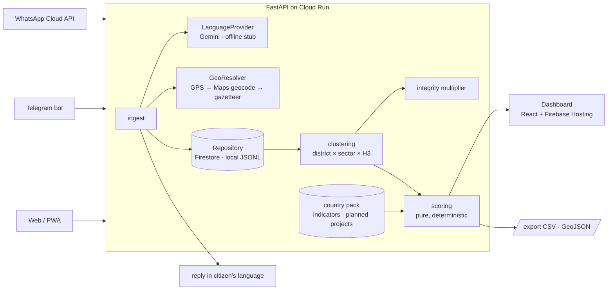

# Civic Demand Platform

**Build with AI: Code for Communities 2.0 · BRICS Track 1 (Innovation)**

India resolves individual grievances fast. Nobody can tell a district which 10 projects to fund next, or whether
the loudest requests are the neediest. This is the planning layer above grievance systems such as CPGRAMS:

1. Citizens send a WhatsApp/Telegram voice note or text in Marathi, Hindi, Hinglish or English.
2. Gemini transcribes, translates, classifies and extracts places (it classifies; it never scores).
3. Requests are geo-resolved to district and H3 cell and clustered.
4. Clusters are fused with district need indicators (MPI, NFHS-5, Jal Jeevan Mission…) and planned investments.
5. A **deterministic, auditable** score ranks them, with an equity weight, an integrity check against brigading,
   and a score breakdown for every project.
6. Citizens get a tracking ID in their own language; anonymised aggregates are exported as open data.

> **Demo data is synthetic.** Every request under `data/synthetic/` has `synthetic: true`, and district indicators are
> flagged placeholders until real extracts land in `data/raw/` (see [docs/data-sources.md](docs/data-sources.md)).

## Architecture



## Priority score

```
Priority(c) = 100 × [0.25·Demand + 0.30·Need + 0.20·Equity + 0.15·Alignment + 0.10·Urgency] × Integrity(c)
```

| Component | Definition |
|---|---|
| Demand | log(1 + unique requesters) ÷ district population per 10k, min-max within the state. Counts people, not messages |
| Need | Sector deficit from official data (e.g. water = 1 − JJM tap coverage), min-max within the state |
| Equity | District MPI headcount ratio (normalised) + 0.1 if an Aspirational District |
| Alignment | 1 if no planned project covers it, 0.5 if planned but delayed, 0 if funded |
| Urgency | Share of requests flagged as a safety/health risk |
| Integrity | 0.5-1.0 multiplier penalising low sender diversity, bursts (30 min) and near-duplicate text |

Clusters with fewer than 3 unique requesters are "emerging", not ranked. Presets: `balanced`, `equity_first`,
and a `volume_only` baseline (raw message count, what naive systems do). Every ranked item carries its
`contributions`, `integrity_penalty` and a `robust` flag (stays top-10 when any weight moves ±20%).
Details: [docs/schema.md](docs/schema.md).

## Quickstart (Windows, from the repo root)

```powershell
python -m venv .venv
.venv\Scripts\python -m pip install -r backend\requirements-dev.txt
copy .env.example .env        # set GEMINI_API_KEY and PHONE_HASH_SALT at minimum
cd backend
..\.venv\Scripts\python -m scripts.build_indicators --allow-placeholder
..\.venv\Scripts\python -m scripts.generate_synthetic
..\.venv\Scripts\python -m scripts.seed --reset
..\.venv\Scripts\python -m uvicorn app.main:app --reload
```

Open http://127.0.0.1:8000/ for the dashboard (served by the same app) and http://127.0.0.1:8000/docs for the API. Run the tests with `..\.venv\Scripts\python -m pytest` from `backend/`.
Without `GEMINI_API_KEY`, the offline keyword stub is used: text only, no translation. Don't demo with it.

## API

| Method | Path | Purpose |
|---|---|---|
| GET | `/health`, `/meta` | Status; pack, presets, provider, synthetic flags, counts |
| POST | `/ingest` | Web intake: `{text?, audio_base64?, audio_mime?, sender_id?, lat?, lon?}` |
| GET/POST | `/webhooks/whatsapp` | Meta verification and inbound messages (text, voice, location) |
| POST | `/webhooks/telegram` | Telegram bot updates (text, voice) |
| GET | `/rankings` | `preset=` plus optional weight overrides, `sector=`, `admin_code=`, `limit=` |
| GET | `/rankings/compare` | Where two presets send the top k (poorest quartile vs least-poor districts) |
| GET | `/clusters/{id}` | Score breakdown, integrity flags, redacted request summaries |
| GET | `/districts`, `/districts/silent` | Indicators + request rates; poor districts with the fewest requests |
| GET | `/requests`, `/requests/{id}` | Redacted request list (review queue: `?status=needs_review`) |
| GET | `/export/aggregates.csv`, `.geojson` | Anonymised aggregates (`level=district\|h3`), groups under 5 people suppressed |

## Deploy (Cloud Run)

```bash
gcloud run deploy civic-api --source . --region asia-south1 --allow-unauthenticated \
  --set-env-vars REPOSITORY=firestore,LANGUAGE_PROVIDER=gemini \
  --set-secrets GEMINI_API_KEY=gemini-key:latest,PHONE_HASH_SALT=phone-salt:latest
```

Seed Firestore once with `REPOSITORY=firestore python -m scripts.seed --reset` (uses your gcloud credentials).
For a throwaway demo without Firestore, set `LOCAL_STORE_PATH=data/synthetic/requests.jsonl` instead (the container
disk is ephemeral). Point the WhatsApp webhook at `https://<service>/webhooks/whatsapp`; for Telegram call
`setWebhook` with `url=https://<service>/webhooks/telegram&secret_token=<TELEGRAM_WEBHOOK_SECRET>`.

## Privacy and safety (DPDP Act 2023)

- Phone numbers are never stored: `requester_hash` = HMAC-SHA256(salt, channel:sender). Rotating the salt unlinks history.
- Raw audio is never stored; it is passed to the language provider and dropped.
- Phone numbers, emails and Aadhaar-shaped numbers are regex-redacted on top of Gemini's redacted summary.
- The API never returns requester hashes or original text; exports are aggregates with k ≥ 5 suppression.
- The LLM never computes or overrides a score; rankings are recommendations for human review.
- Free-tier Gemini inputs may be used to improve Google's models: use only synthetic data on it; production would run
  on Vertex AI or a paid tier.

## Designed to meet the DPG Standard

Apache-2.0 code, CC BY 4.0 docs and synthetic data ([OWNERSHIP.md](OWNERSHIP.md), [data/LICENSE-DATA.md](data/LICENSE-DATA.md)).
Platform independence: Gemini sits behind `LanguageProvider` (open alternative: AI4Bharat IndicConformer +
IndicTrans2), Firestore behind `RequestRepository` (open alternative: Postgres/PostGIS). Standards: OpenAPI 3,
GeoJSON, H3, ISO 639 / BCP-47, ISO 3166-2. We claim "designed to meet the DPG Standard", not "is a DPG".

## BRICS generalisation

A country is a **pack**: `data/packs/<ID>.json` + a district reference CSV + indicator files. The core schema,
scoring and API do not change. See [docs/schema.md](docs/schema.md#country-packs).

## Repository layout

```
backend/app/        FastAPI app: ingest, language, geo, clustering, integrity, scoring, service, channels
backend/scripts/    build_indicators, generate_synthetic, seed
backend/tests/      pytest suite (self-contained test pack)
data/packs/         country/state pack config
data/reference/     district list, centroids, population, local names
data/raw/           real source extracts (you add these)
data/processed/     built indicator tables and planned projects
data/synthetic/     labelled synthetic requests + manifest
docs/               schema and data sources
frontend/           single-page dashboard, served by the API at / (see frontend/README.md)
```
